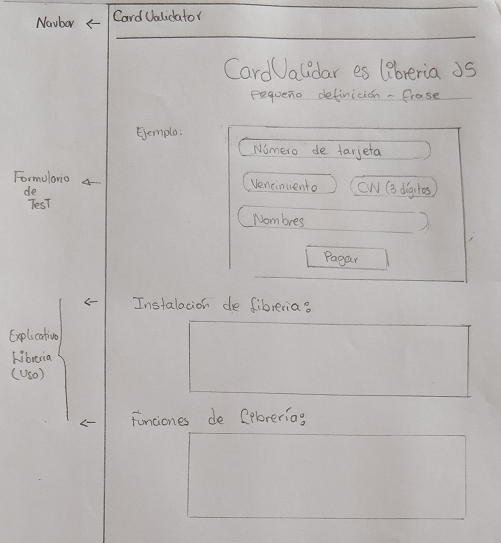

# Valida datos de tarjetas de crédito

## Descripción

CardValidator valida los datos de las tarjetas de crédito. El número de tarjeta es validado según el algoritmo de Luhn, además valida la fecha de vencimiento, el Código de verificación (CVV) de tres dígitos y el nombre completo.


## Implementación de libreria

#### Sketch

Se realizó un primer sketch de la librería en vista desktop.



## Descripción

CardValidator es una librería Javascript que permite validar datos importantes de las tarjetas de crédito, como el número, código de verificación, fecha de vencimiento y nombre completo. Cuando todos los `<input>` del formulario son válidos, activa el botón de Pagar.

Además añade la clase `.error` a los `<input>`s que no pasen la validación, o la clase `.success` en caso de que sí pase.

#### Validar número de tarjeta de crédito.

+ Valida el número de la tarjeta mediante el algoritmo de Luhn.
+ Longitud de dígitos igual a 16.
+ Valida sólo el ingreso de números.

#### Validar fecha de vencimiento de la tarjeta.

+ Valida fechas futuras.
+ Valida sólo el ingreso de números.

#### Validar código de verificación.

+ Longitud del cvv igual a tres dígitos.
+ Valida sólo el ingreso de números.

#### Validar el nombre completo.

+ Longitud mínima del nombre 5 caracteres.
+ Valida sólo el ingreso de letras.

### Especificaciones

CardValidator permite validar tarjetas de crédito con las siguientes características:

+ Número de tarjeta de crédito: longitud de 16 dígitos.
+ Mes de expiración de la tarjeta: longitud de dos dígitos, se debe ingresar un número del 01 al 12 según los meses calendarios Enero a Diciembre.  
+ Año de expiración de la tarjeta: longitud de cuatro dígitos, se debe ingresar el año en números.
+ Código de verificación: longitud de 3 dígitos, en números.
+ Nombre completo: longitud mínima de 5 caracteres.

### Instalación

1. Descargar o clonar este repositorio.
2. Esta librería está disponible en javascript 5 y ES6, así que si se elige la primera opción, agregar el archivo `cardValidator.js` que se encuentra dentro de `public/js`. En caso que se desee utilizar código escrito en ES6, agregar el archivo `cardValidator.js` que se encuentra dentro de `src`.
3. Dentro del formulario para validar la tarjeta de crédito, incluír en cada etiqueta `input` los siguientes `id`:

```html
  <input id="cn" /> <!-- Para el número de tarjeta -->
  <input id="month" /> <!-- Para el mes de expiración -->
  <input id="year" /> <!-- Para el año de expiración -->
  <input id="cvv" /> <!-- Para el código de verificación -->
  <input id="name" /><!-- Para el nombre completo -->
```

### Uso

Agregar el evento `submit` al formulario mediante el siguiente código:

```js
const form = document.querySelector('form');

form.addEventListener('submit', (e) => {
    e.preventDefault();
    validateData(numCard, cvv, name, year, month);
  });
```

## Herramientas

`babel` `ecmascript 6` `html5` `bootstrap 3`

## Créditos

+ Lidia Ramirez.
+ Patricia Urco.
